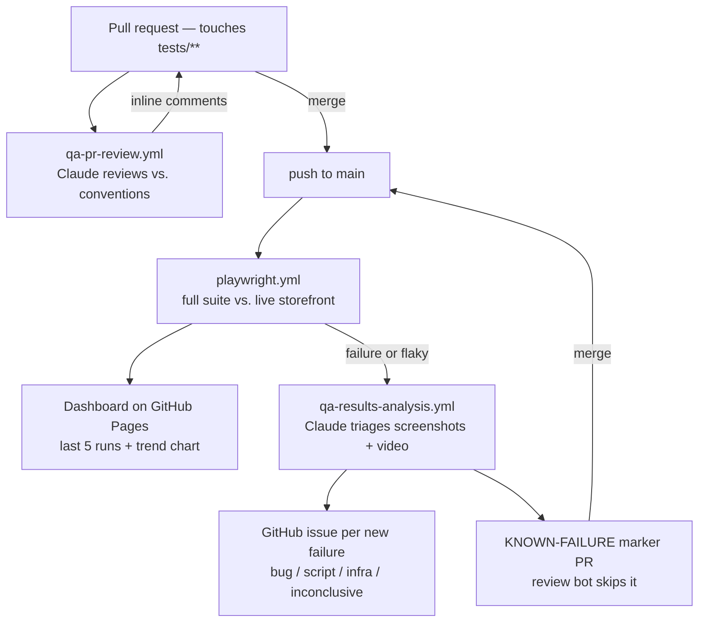

# playwright-fullstack-test-framework

Playwright test automation for the [QA Demo](https://qademo.com) storefront — a React app
backed by a JSON REST API (`/api/*`). The suite covers both the web UI and the API layer
directly (the `*-api.*` specs), across the auth and product domains.

What's deliberately *not* in the framework, and why — plus a few non-obvious calls — is written
up in [docs/design-notes.md](docs/design-notes.md).

## Getting started

```bash
npm ci
npx playwright install --with-deps chromium
cp tests/functional/config/.env.example tests/functional/config/.env
```

Then fill in `tests/functional/config/.env` (`QA_STANDARD_USER_*`, `QA_LOCKED_USER_*`,
`QA_ADMIN_USER_*`). qademo lists its demo accounts right on the `/login` page — copy them from
there. `QA_ENV` is optional and defaults to `demo` (see `environments.ts`).

Run tests:

```bash
npm test              # headless
npm run test:headed   # headed browser
npm run test:ui       # Playwright UI mode
npm run report        # open the last HTML report
```

The suite runs **single-worker** (`workers: 1` in `playwright.config.ts`). qademo is a small
shared demo server; parallel workers overwhelm its cart/order API and it starts dropping
requests. Override per run with `npx playwright test --workers=4` if you know the server is
quiet.

### How auth works

`tests/functional/global.setup.ts` signs in once as the standard user and writes the session to
`auth.json` (gitignored), which every test loads via `storageState`. Two details:

- It waits for the `POST /api/auth/login` response before capturing state — `login()` returns as
  soon as the UI updates, which is a tick before the session token is persisted.
- It strips the `session_id` entry before saving. That value is an anonymous id the server keys
  the **cart** by; if every test context loaded the same one they'd all share one server-side
  cart. Dropping it gives each context its own empty cart, like a fresh visitor.

Only `/checkout` requires an authenticated session; everything else works logged in or out.

## Test structure

Tests live under `tests/functional/<domain>/[<feature>/]`, split by concern:

| File | Contains |
|---|---|
| `<name>.actions.ts` | Raw Playwright interactions/locators |
| `<name>.assertions.ts` | Checks, written with `expect.soft(...)` |
| `<name>.data.ts` | Typed **input** fixtures (form values, product data) |
| `<name>.flow.ts` | Multi-step flows composed from 2+ actions |
| `<name>.spec.ts` | Test cases — call flow/assertion helpers (a single named action is fine too), no raw `page.*` / `expect(...)` |

Domain folders (`auth`, `product`) keep their files flat. Add a `<feature>/` subfolder only
when the children are independently-testable features in their own right — `order/cart` and
`order/checkout` are separate flows that share the `order` parent; product listing vs. details
are just views of one feature, so they stay flat siblings (`product-list.spec.ts`,
`product-details.spec.ts`).

A domain's API-layer tests reuse the exact same split, in the same domain folder, just with an
`-api` suffix on every file — `auth-api.actions.ts` / `auth-api.assertions.ts` /
`auth-api.data.ts` / `auth-api.flow.ts` / `auth-api.spec.ts` (+ `auth-api-error.spec.ts`) sit
alongside `auth.actions.ts` etc. The only real difference is the interaction layer: `.actions.ts`
calls `sendApiRequest(...)` (`utils/api.utils.ts`) instead of `page.*`, and `.assertions.ts` uses
`assertResponseStatus`/`assertResponseBody` instead of locator-based `expect.soft(...)` checks.

Current modules: `auth` (+ `auth-error`, `auth-api`, `auth-api-error`), `product` (list +
details, + `product-api-list`, `product-api-details`, `product-api-details-error`), `order/cart`,
`order/checkout` (+ `checkout-error`). Config and base URLs come from
`tests/functional/config/`.

Helpers shared across two or more features — pure functions (parsing, formatting, date math) or
shared Playwright-touching primitives (sending a request, asserting a response) alike — live in
`tests/functional/utils/<name>.utils.ts` instead of being duplicated per feature.
`utils/data.utils.ts` holds `parsePrice`/`formatPrice`, used by both `order/cart` and
`order/checkout`. `utils/api.utils.ts` holds the primitives every domain's API layer builds on:
`sendApiRequest` (wraps `request.fetch(...)`), `assertResponseStatus`, and `assertResponseBody`
(see rule 8 below for its exact-vs-partial matching).

## Coding conventions

Enforced on every PR by the [PR review workflow](#pr-review-against-conventions) — treat this
list as the source of truth rather than any one existing file.

1. **File split per feature** — separate concerns into `<name>.actions.ts` /
   `<name>.assertions.ts` / `<name>.data.ts` / `<name>.flow.ts` / `<name>.spec.ts` as described
   under [Test structure](#test-structure). Domains keep files flat; add a `<feature>/`
   subfolder only for independently-testable sub-features. Dumping locators or assertions
   straight into a `.spec.ts` or `.flow.ts` breaks the split. A domain's API-layer tests get
   their own `-api`-suffixed file set in the same domain folder (`auth-api.actions.ts` next to
   `auth.actions.ts`, etc.) — same split, same conventions, just swapping `page.*` interactions
   for `request.fetch(...)` calls via `api.utils.ts`.
2. **`.spec.ts` files contain no raw `page.*` calls and no raw `expect(...)`.** They call
   flow/assertion helpers; calling a single named action directly is fine when there's no
   multi-step journey to name (the suite does this with `openHomePage`, `clickViewCartButton`).
   A new interaction or check belongs in `.actions.ts` / `.assertions.ts`, never inline.
3. **`.flow.ts` functions compose two or more actions/flows.** A flow that just forwards to one
   action is pointless indirection — delete it and call the action directly.
4. **`.data.ts` holds every typed data-shape declaration** — interfaces/types for input fixtures
   and expected/response structures alike, regardless of whether it's used as input or as an
   expected value (`CartData`, `CheckoutFormData`, `LoginResponseBody`/`ExpectedLoginUser`, ...).
   Only the literal expected values the app produces — error messages, headings, status text —
   are exempt: those live in `.assertions.ts` as a named assertion function, one per message (see
   `auth.assertions.ts`, `checkout.assertions.ts`). A type/interface declared inside a
   `.assertions.ts` file is a smell, same as a hardcoded error string in `.data.ts`. A negative
   test that only overrides one or two fields of an existing fixture doesn't get a new named
   fixture either — spread the base fixture and override inline at the call site, the way
   `checkout-error.spec.ts` and `auth-api-error.spec.ts` do it (e.g.
   `{ ...standardUserLoginBody, password: '' }`). A dedicated fixture per field doesn't scale —
   a 30-field form testing every required field would otherwise clutter `.data.ts` with one
   fixture per field.
5. **Reusable utility functions live in `tests/functional/utils/<name>.utils.ts`, not
   duplicated per feature.** A helper needed by more than one feature — a pure function (parsing,
   formatting, date math) or a shared Playwright-touching primitive (sending a request, asserting
   a response) alike — belongs in a shared `.utils.ts` file under `tests/functional/utils/` and
   gets imported, not copy-pasted. `utils/data.utils.ts` holds `parsePrice`/`formatPrice`,
   imported by both `cart.assertions.ts` and `checkout.assertions.ts`. `utils/api.utils.ts` holds
   the API-layer primitives every domain's API tests build on — `sendApiRequest`,
   `assertResponseStatus`, `assertResponseBody` — so a domain's `.actions.ts` calls
   `sendApiRequest` rather than `request.fetch(...)` directly, and its `.assertions.ts` builds
   named assertions on top of `assertResponseStatus`/`assertResponseBody` rather than
   reimplementing status/body checks inline. Copy-pasting the same function into two feature
   files instead of sharing it is a duplication bug, not a style nit.
6. **Locators are testid-first.** `getByTestId(...)` (including regex testids like
   `getByTestId(/^cart-item-\d+$/)`) for element identity — clicks, scoping, reading a field's
   value. Fall back to `getByRole` / `getByLabel` only where there's no testid (e.g. the login
   form inputs). Keep `getByRole` / `getByText` where the *visible semantics* are what's under
   test — a user-facing error message, an accessible name, a heading level. Raw CSS/XPath only
   when there's genuinely no testid and no meaningful role (e.g. `.locator('xpath=../..')` to a
   parent row), with a short comment.
7. **Assertions use `expect.soft(...)`**, not bare `expect(...)`, inside `.assertions.ts` files,
   so one run surfaces every failing check instead of stopping at the first.
8. **Assertions match exactly unless the value genuinely isn't fixed.** Prefer `toHaveText(...)`
   over `toContainText(...)`, and `getByText(..., { exact: true })` over a substring match;
   assert an element's full text via its testid rather than a fragment. For a genuinely dynamic
   value (order number, today's date, stock count) use an anchored regex
   (`toHaveText(/^Order #\d+$/)`) or compute the expected value — don't loosen the match. The
   same principle applies to API response bodies: `assertResponseBody(actual, expected, options)`
   (`utils/api.utils.ts`) defaults to a partial match (`toMatchObject`) so unlisted fields aren't
   a problem, but pass `{ exact: true }` once the full response shape is known, so an unexpected
   extra field gets caught (see `assertLoginSuccess` in `auth-api.assertions.ts`). For a field
   that's genuinely dynamic every run — a JWT, a generated id — mix an asymmetric matcher like
   `expect.stringMatching(/regex/)` into the same `expected` object alongside the exact fields,
   the same way an anchored regex handles a dynamic value in the UI; don't drop to a full partial
   match just because one field is dynamic.
9. **Every `test.describe(...)` has a `{ tag: '@xxx' }`** matching its domain (`@auth`,
   `@product`, `@cart`, `@checkout`). API-layer specs carry a second `@api` tag alongside their
   domain tag — e.g. `{ tag: ['@auth', '@api'] }` in `auth-api.spec.ts` — so the API suite can be
   run or filtered independently of the UI suite.
10. **`test.describe.configure({ mode: 'serial' })`** whenever tests depend on state left by
    earlier tests in the file. When that state lives in one browser context (the cart, an auth
    session), the suite also shares a single `page` created in
    `test.beforeAll(async ({ browser }) => { page = await browser.newPage(); })` and closed in
    `test.afterAll` — see `cart.spec.ts` and `checkout-error.spec.ts`.
11. **Every click is followed by a deterministic wait** — `await page.waitForLoadState('networkidle')`,
    a specific locator/state (`getByTestId('...').waitFor()`, `expect(...).toBeVisible()`), or
    `await page.waitForResponse(...)` for a click that fires an API call (armed **before** the
    click). **Never `page.waitForTimeout(...)` or any hardcoded sleep.**
12. **Cart and order mutations confirm the server round-trip.** `/api/cart/items` and
    `/api/orders` calls are confirmed with `page.waitForResponse(...)` armed before the click —
    the app reloads cart/order state from the server, so navigating before the request settles
    loses the change. See `mutateCart` in `order/cart/cart.actions.ts`. There is no
    click-and-retry helper.
13. **Test titles read as `'validate user can/cannot <do something>'`**, matching the rest of
    the suite.
14. **Base URL comes from `tests/functional/config/environments.ts`; credentials from the
    module's own `<name>.data.ts` via `requireEnv(...)`** (e.g. `auth/auth.data.ts`) — never a
    hardcoded URL, username, or password in a test.

Tests are commonly drafted with AI pair-programming assistance — the PR review workflow is what
keeps AI-authored and human-authored changes alike to these conventions, rather than trusting
the drafting process itself.

## Automated workflow

Besides the tests themselves, this repo automates the process around them.



### PR review against conventions

`.github/workflows/qa-pr-review.yml` — on every PR that touches `tests/**` or
`playwright.config.ts`, Claude reviews the diff against the conventions above (prompt:
[`qa-pr-review.md`](.github/prompts/qa-pr-review.md)) and posts inline PR comments citing the
specific convention violated, with a fix in the repo's existing style. If nothing violates a
convention, it says so instead of manufacturing nitpicks. PRs opened by bots (the marker PRs
below) are skipped.

### Continuous execution

`.github/workflows/playwright.yml` — on every push to `main` (and via manual dispatch), the full
suite runs against the live storefront. Runs are queued (`concurrency`, no cancel-in-progress)
rather than overlapping, since concurrent runs would double the load on qademo's API. A test
that only passes on retry is still treated as a build failure
([`scripts/check-flaky.js`](scripts/check-flaky.js), which walks the JSON report and fails the
build on any `flaky` outcome). The HTML report is uploaded as an artifact, plus
screenshots/videos/traces on failure.

Credentials are supplied as GitHub Actions secrets: `QA_STANDARD_USER_USERNAME` /
`QA_STANDARD_USER_PASSWORD`, `QA_LOCKED_USER_USERNAME` / `QA_LOCKED_USER_PASSWORD`,
`QA_ADMIN_USER_USERNAME` / `QA_ADMIN_USER_PASSWORD_PREFIX`. The admin password rotates daily to
`<prefix><DDMMYYYY>`; the date suffix is computed in `auth.data.ts`, so only the fixed prefix is
stored as a secret. The Claude workflows also need
`CLAUDE_CODE_OAUTH_TOKEN` (from `claude setup-token` — uses your Claude subscription, no
separate API billing).

### Test report dashboard

The same workflow publishes a dashboard to **GitHub Pages**
([mastahkitz.github.io/playwright-fullstack-test-framework](https://mastahkitz.github.io/playwright-fullstack-test-framework/))
after every run, pass or fail. It keeps the **last 5 runs** — status, test/pass/fail/flaky/skipped
counts, commit, duration, and a link to that run's full Playwright HTML report served inline (no
artifact download) — plus an inline trend chart across those runs (total test count as a line, a
green "passed" area and a hatched "not passed" wedge beneath it, with a per-run hover breakdown). [`scripts/build-report-dashboard.js`](scripts/build-report-dashboard.js) reads
`test-report/results.json`, copies this run's report in, carries the four most recent prior reports
forward from the existing `gh-pages` checkout, regenerates `index.html`, and the workflow
force-pushes the assembled site to the `gh-pages` branch — older runs are purged automatically. A
one-line summary of the run (with dashboard + report links) is also written to the workflow's job
summary, so counts are visible on the Actions run page without opening anything.

One-time setup: **Settings → Pages → Build and deployment → Source: Deploy from a branch →
`gh-pages` / `/ (root)`**, after the first run has created the branch.

### Automated failure analysis

`.github/workflows/qa-results-analysis.yml` — triggered by `workflow_run` when the run above
fails (a separate workflow because Claude Code Action can't be triggered by `push` directly).
Claude (prompt: [`qa-results-analysis.md`](.github/prompts/qa-results-analysis.md)) inspects
the JSON report, failure screenshots, and 2fps video frames for each failing/flaky test, and for
each one:

- Reads the file:line from the stack trace and checks for an existing
  `// KNOWN-FAILURE(#123): <reason> — retriage if this changes` marker on the line above.
  - **Marker present, issue still open** → already tracked; skipped, just noted in the summary.
  - **Marker present, issue closed** → regression; treated as new, stale marker replaced.
  - **No marker** → new failure.
- Classifies each new/regressed failure as a **likely product bug**, **likely script issue**
  (stale testid, bad assumption, test-side flake), **likely infra/server flake** (a
  `waitForResponse` timeout with a healthy screenshot — qademo dropping a request under load),
  or **inconclusive** — grounded in what the screenshot/video actually shows.
- Files a GitHub issue per new/regressed failure with the classification, evidence, and a
  suggested next step.
- Opens one PR adding the `KNOWN-FAILURE(#N)` marker comments (never pushed straight to `main`),
  so the next run recognizes the same failure and doesn't re-file it.

Analysis is strictly triage: it never edits test logic, and every marker/issue lands via a PR
for a human to approve.
