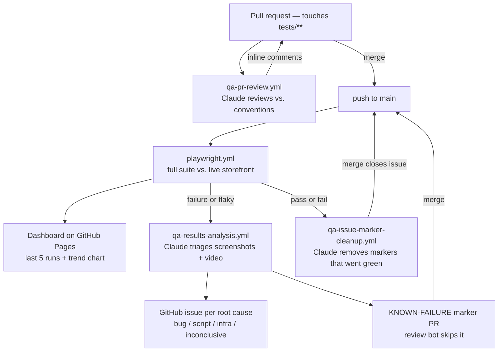

# playwright-fullstack-test-framework

Playwright test automation for the [QA Demo](https://qademo.com) storefront — a React app
backed by a JSON REST API (`/api/*`). The suite covers both the web UI and the API layer
directly (the `*-api.*` specs), across the auth and product domains.

What's deliberately *not* in the framework, and why — plus a few non-obvious calls — is written
up in [docs/design-notes.md](docs/design-notes.md).

## Getting started

```bash
npm ci
npx playwright install --with-deps chromium
cp tests/functional/config/.env.example tests/functional/config/.env
```

Then fill in `tests/functional/config/.env` (`QA_STANDARD_USER_*`, `QA_LOCKED_USER_*`,
`QA_ADMIN_USER_*`). qademo lists its demo accounts right on the `/login` page — copy them from
there. `QA_ENV` is optional and defaults to `demo` (see `environments.ts`).

Run tests:

```bash
npm test              # headless, chromium
npm run test:headed   # headed browser
npm run test:ui       # Playwright UI mode
npm run report        # open the last HTML report
```

The suite runs **5 workers** by default (`workers: 5` in `playwright.config.ts`) — qademo
handles that fine. Product create/delete are still kept off to the side: they carry an
`@mutating` tag and run as their own CI phase (`playwright.yml`), separately from everything
else, so they never race with the product list/count assertions elsewhere in the suite.
Override the worker count per run with `npx playwright test --workers=N`.

### Cross-browser

Browser is picked by `QA_BROWSER` (`tests/functional/config/browsers.ts`), defaulting to
`chromium`:

```bash
npm run test:firefox
npm run test:webkit
npm run test:edge
```

or set it yourself: `QA_BROWSER=firefox npx playwright test` (bash) /
`$env:QA_BROWSER='firefox'; npx playwright test` (PowerShell). `webkit` is Playwright's own
WebKit build (the standard proxy for Safari on non-Mac machines); `edge` drives the real,
system-installed Microsoft Edge via the `msedge` channel. First time using firefox/webkit,
install their binaries: `npx playwright install --with-deps firefox webkit`.

The same choice is available when triggering CI by hand — see
[Continuous execution](#continuous-execution) below. A plain push to `main` always runs
chromium.

### How auth works

`tests/functional/global.setup.ts` signs in once as the standard user and writes the session to
`auth.json` (gitignored), which every test loads via `storageState`. Two details:

- It waits for the `POST /api/auth/login` response before capturing state — `login()` returns as
  soon as the UI updates, which is a tick before the session token is persisted.
- It strips the `session_id` entry before saving. That value is an anonymous id the server keys
  the **cart** by; if every test context loaded the same one they'd all share one server-side
  cart. Dropping it gives each context its own empty cart, like a fresh visitor.

Only `/checkout` requires an authenticated session; everything else works logged in or out.

## Test structure

Tests live under `tests/functional/<domain>/[<feature>/]`, split by concern:

| File | Contains |
|---|---|
| `<name>.actions.ts` | Raw Playwright interactions/locators |
| `<name>.assertions.ts` | Checks, written with `expect.soft(...)` |
| `<name>.data.ts` | Typed **input** fixtures (form values, product data) |
| `<name>.flow.ts` | Multi-step flows composed from 2+ steps — actions, assertions, other flows (may mix) |
| `<name>.spec.ts` | Test cases — call flow/assertion helpers (a single named action is fine too), no raw `page.*` / `expect(...)` |

Domain folders (`auth`, `product`) keep their files flat. Add a `<feature>/` subfolder only
when the children are independently-testable features in their own right — `order/cart` and
`order/checkout` are separate flows that share the `order` parent; product listing vs. details
are just views of one feature, so they stay flat siblings (`product-list.spec.ts`,
`product-details.spec.ts`).

A domain's API-layer tests reuse the exact same split, in the same domain folder, just with an
`-api` suffix on every file — `auth-api.actions.ts` / `auth-api.assertions.ts` /
`auth-api.data.ts` / `auth-api.flow.ts` / `auth-api.spec.ts` (+ `auth-api-error.spec.ts`) sit
alongside `auth.actions.ts` etc. The only real difference is the interaction layer: `.actions.ts`
calls `sendApiRequest(...)` (`utils/api.utils.ts`) instead of `page.*`, and `.assertions.ts` uses
`assertResponseStatus`/`assertResponseBody` instead of locator-based `expect.soft(...)` checks.

Current modules: `auth` (+ `auth-error`, `auth-api`, `auth-api-error`), `product` (list +
details, + `product-api-list`, `product-api-details`, `product-api-details-error`,
`product-api-create`, `product-api-delete`), `order/cart`, `order/checkout` (+
`checkout-error`). Config and base URLs come from `tests/functional/config/`.

Helpers shared across two or more features — pure functions (parsing, formatting, date math) or
shared Playwright-touching primitives (sending a request, asserting a response) alike — live in
`tests/functional/utils/<name>.utils.ts` instead of being duplicated per feature.
`utils/data.utils.ts` holds `parsePrice`/`formatPrice`, used by both `order/cart` and
`order/checkout`. `utils/api.utils.ts` holds the primitives every domain's API layer builds on:
`sendApiRequest` (wraps `request.fetch(...)`), `assertResponseStatus`, and `assertResponseBody`
(see [convention 8](docs/conventions.md) for its exact-vs-partial matching).

## Coding conventions

The suite follows a strict per-feature file split (`.actions` / `.assertions` / `.data` /
`.flow` / `.spec`, with `-api` variants for the API layer) plus a set of numbered rules covering
locators, soft assertions, exact-vs-dynamic matching, tagging, serial-mode state, deterministic
waits, flow assertion scope (status always, body when verifying), once-per-file API auth, and
naming.

The full list is in **[docs/conventions.md](docs/conventions.md)** — the single source of truth,
enforced on every PR by the [review workflow](#pr-review-against-conventions), which cites
violations by number.

Tests are commonly drafted with AI pair-programming assistance — that review workflow is what
keeps AI-authored and human-authored changes alike to these conventions, rather than trusting
the drafting process itself.

## Automated workflow

Besides the tests themselves, this repo automates the process around them.



### PR review against conventions

`.github/workflows/qa-pr-review.yml` — on every PR that touches `tests/**` or
`playwright.config.ts`, Claude reviews the diff against [docs/conventions.md](docs/conventions.md)
(prompt: [`qa-pr-review.md`](.github/prompts/qa-pr-review.md)) and posts inline PR comments citing
the specific convention violated, with a fix in the repo's existing style. If nothing violates a
convention, it says so instead of manufacturing nitpicks. PRs opened by bots (the marker PRs
below) are skipped.

### Continuous execution

`.github/workflows/playwright.yml` — on every push to `main`, the full suite runs against the
live storefront on chromium. It can also be triggered by hand (**Actions → Playwright Tests →
Run workflow**) with two optional inputs: `browser` (chromium/firefox/webkit/edge — the same
`QA_BROWSER` mechanism as local runs, see [Cross-browser](#cross-browser) above) and `tag`, a
free-text `@tag` (e.g. `@smoke`) that's ANDed onto whichever mutating/non-mutating phase is
running, on top of the existing `@mutating` split — Playwright combines a project's `grep` with
a command-line `--grep` rather than one replacing the other. A plain push ignores both and always
runs the full suite on chromium.

Runs are queued (`concurrency`, no cancel-in-progress) rather than overlapping, regardless of
which browser they're running — they all hit the same live qademo backend and data, so a
manually-dispatched Edge run still waits for a Chromium push run to finish rather than racing it.
A test that only passes on retry is still treated as a build failure
([`scripts/check-flaky.js`](scripts/check-flaky.js), which walks the JSON report and fails the
build on any `flaky` outcome). The HTML report is uploaded as an artifact, plus
screenshots/videos/traces on failure.

Credentials are supplied as GitHub Actions secrets: `QA_STANDARD_USER_USERNAME` /
`QA_STANDARD_USER_PASSWORD`, `QA_LOCKED_USER_USERNAME` / `QA_LOCKED_USER_PASSWORD`,
`QA_ADMIN_USER_USERNAME` / `QA_ADMIN_USER_PASSWORD_PREFIX`. The admin password rotates daily to
`<prefix><DDMMYYYY>`; the date suffix is computed in `auth.data.ts`, so only the fixed prefix is
stored as a secret. The Claude workflows also need
`CLAUDE_CODE_OAUTH_TOKEN` (from `claude setup-token` — uses your Claude subscription, no
separate API billing).

### Test report dashboard

The same workflow publishes a dashboard to **GitHub Pages**
([mastahkitz.github.io/playwright-fullstack-test-framework](https://mastahkitz.github.io/playwright-fullstack-test-framework/))
after every run, pass or fail. It keeps the **last 5 runs** — status, run/commit links, browser
(shown by the name people actually recognize — `webkit` reports as **Safari**), how it was
triggered (`CI` for a push, `Manual` for `workflow_dispatch`), any extra `@tag` filter the
manual run was launched with (the built-in mutating/non-mutating phase split isn't shown — it
applies to every run — so a blank `Tags` cell means the whole suite ran),
test/pass/fail/flaky/skipped counts, duration, and a link to that run's full Playwright HTML
report served inline (no artifact download) — plus an inline trend chart across those runs (total test count as a line, a
green "passed" area and a hatched "not passed" wedge beneath it, with a per-run hover breakdown). [`scripts/build-report-dashboard.js`](scripts/build-report-dashboard.js) reads
`test-report/results.json`, copies this run's report in, carries the four most recent prior reports
forward from the existing `gh-pages` checkout, regenerates `index.html`, and the workflow
force-pushes the assembled site to the `gh-pages` branch — older runs are purged automatically. A
one-line summary of the run (with dashboard + report links) is also written to the workflow's job
summary, so counts are visible on the Actions run page without opening anything.

One-time setup: **Settings → Pages → Build and deployment → Source: Deploy from a branch →
`gh-pages` / `/ (root)`**, after the first run has created the branch.

### Automated failure analysis

`.github/workflows/qa-results-analysis.yml` — triggered by `workflow_run` when the run above
fails (a separate workflow because Claude Code Action can't be triggered by `push` directly).
Workflow steps first prepare what Claude shouldn't derive itself — 2fps video frames, and, for
each failing/flaky test, a deterministic **anchor**: the deepest stack frame in a
`.spec/.flow/.actions/.assertions.ts` file. In a layered suite the top of a stack trace lands in
a different file depending on how the test broke, so the anchor is the one stable line the marker
goes on and every run computes it the same way. Another step fetches the open `qa-triage` issues
and PRs and every in-code marker and compacts them into a lookup file. Then Claude (prompt:
[`qa-results-analysis.md`](.github/prompts/qa-results-analysis.md)) inspects the JSON report,
screenshots, and video frames for each failing/flaky test, and for each one:

- Rules out that the failure is already tracked, in three places: a
  `// KNOWN-FAILURE(#123) [<spec>::<test>]: <reason> — retriage if this changes` marker on the
  anchor line (issue open → skip; issue closed → regression, treated as new); an open GitHub
  issue; or an open triage/decision PR from an earlier run not yet merged. Matching is by test
  identity — the `spec :: test title` recorded in the marker and in a `## Failure anchors` block
  at the top of every issue/PR body — so a rename or a moved line doesn't cause a duplicate.
  Anything already covered is noted in the summary, not re-filed.
- Groups failures that share one root cause, then classifies each group as a **likely product
  bug**, **likely script issue** (stale testid, bad assumption, test-side flake), **likely
  infra/server flake** (a `waitForResponse` timeout with a healthy screenshot — qademo dropping a
  request under load), or **inconclusive** — grounded in what the screenshot/video actually shows.
- Files one GitHub issue per group (except pure script fixes) with the classification, evidence,
  and a suggested next step.
- Opens **one PR for the confident groups** — `KNOWN-FAILURE(#N)` markers for product bugs, the
  actual test fix for script issues — and, for groups it can't call, a separate **draft decision
  PR** with no code changes whose body lays out a mark-as-bug option and a fix-the-test option
  per failure for a human to pick.

Analysis is strictly triage: every marker/issue/fix lands via a PR for a human to approve, and it
never pushes to `main`.

### Issue and marker cleanup

`.github/workflows/qa-issue-marker-cleanup.yml` — triggered by `workflow_run` after **every**
run, pass or fail (prompt:
[`qa-issue-marker-cleanup.md`](.github/prompts/qa-issue-marker-cleanup.md)). The
mirror image of failure analysis. A workflow step greps every `KNOWN-FAILURE(#N)` marker and
pulls every `qa-triage` issue's state into a lookup file; Claude then takes each marker whose
guarded test — named in the marker itself, or resolved from the call graph for older markers —
passed cleanly (first try, no retry) in that run, and opens one PR removing them.
For each linked issue, if **every** marker pointing at it cleared this run the PR gets a
`Closes #N` so merging closes the issue; if only some did — the rest still failing, or their
test simply wasn't exercised in a partial `workflow_dispatch` run — it comments on the issue
instead (which cleared, which didn't) and leaves it open.
Each removal is an isolated one-line change so a reviewer can drop any they don't yet trust —
one green run isn't proof a bug is fixed.
